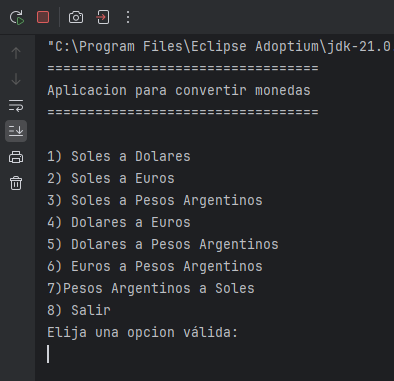
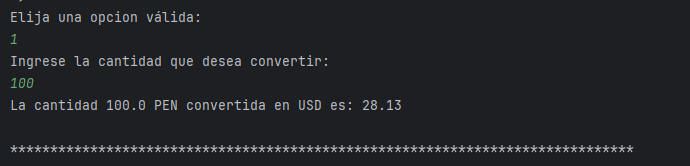
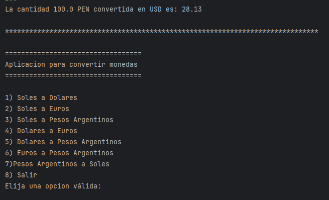
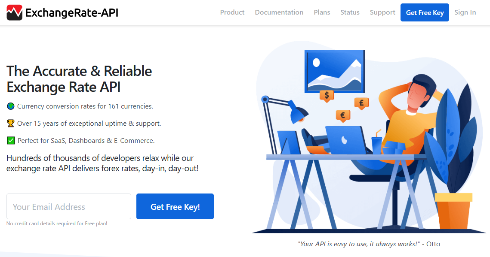
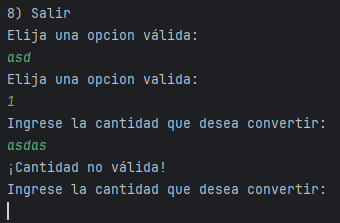

# Challenge Conversor de Monedas
<p>Esta aplicación es una realización del desafío de la formación Java Orientado a Objetos G8 - ONE" de Alura LATAM</p>

## ¿Qué hace?
Esta aplicación realilza el cambio de una moneda a otra distinta que se han escogido del menú<br>

## ¿Cómo funciona?
1. Se escoge una opcion del menu.<br>
   <br><br>
2. Se escriba la cantidad a convertir.<br>
   <br><br>
3. Se muestra el resultado y aparece nuevamente el menu para volver a realizar otra conversion hasta escoger la opcion (8) que finaliza el programa.<br>
   <br><br>

## Características
- Se ha usado la API https://www.exchangerate-api.com/.<br>
   <br><br>
- El programa reconoce cuando se escribe opciones o cantidades no validas y pide digitar nuevamente<br>
   <br><br>


## Tecnologías Utilizadas
- <span>JAVA</span>

## Instalación
1. Clona este repositorio:
   ```bash
   git clone https://github.com/DescansandoShh/Conversor-de-Monedas.git
2. Abre el archivo index.html
   
